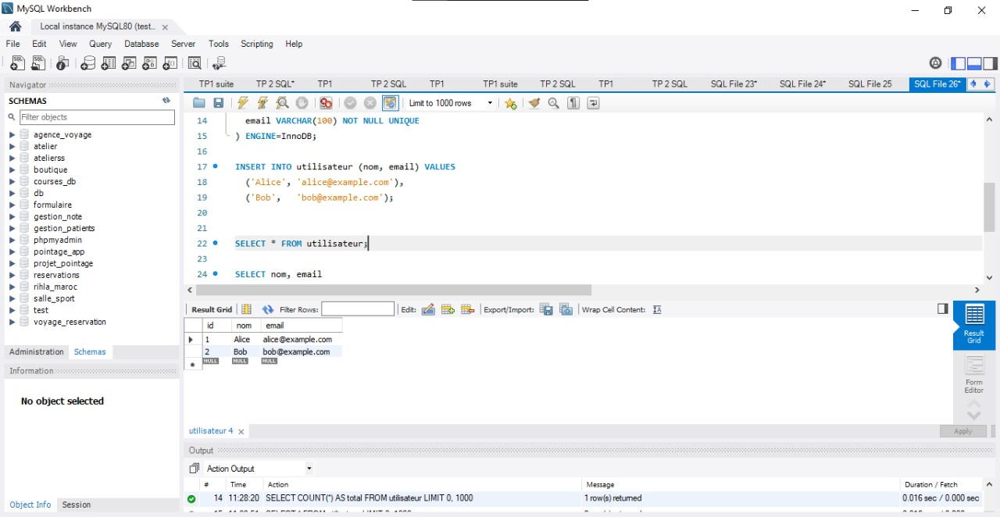
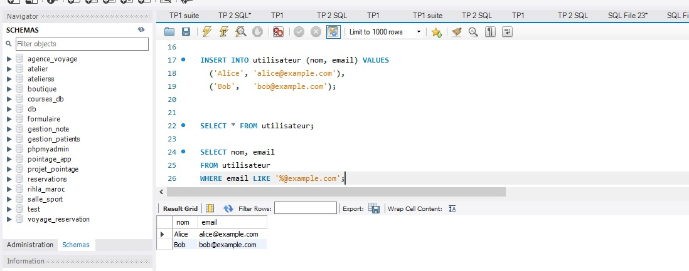
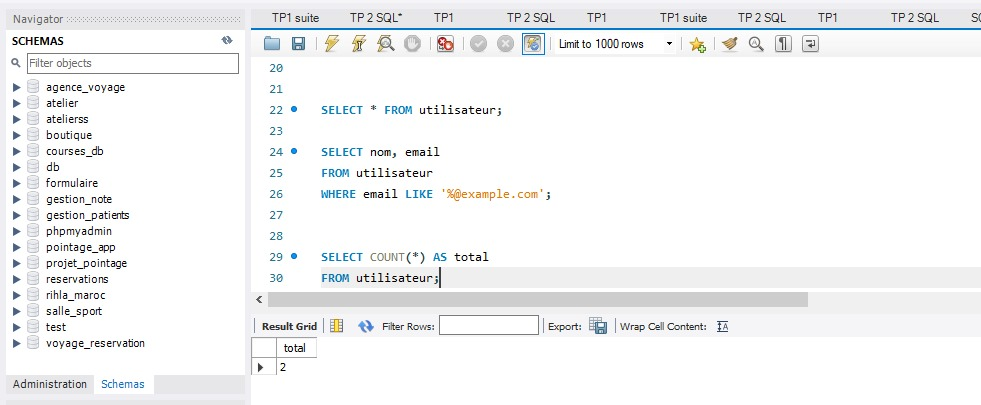

# 📘 Lab 1 – Mise en place et découverte de MySQL

## 🔹 Objectif

Installer MySQL, le sécuriser, se connecter à la ligne de commande, créer une base de données, une table, insérer des données et exécuter des requêtes simples.

## 🔹 Contenu du Lab

Installation de MySQL (Linux, macOS ou Windows).

Sécurisation du serveur (mot de passe root, suppression utilisateur anonyme, désactivation accès root distant).

Connexion à la CLI MySQL.

Création d’une base de données et sélection.

Création d’une table utilisateur et ajout de données.

Exécution de requêtes simples (affichage, recherche, comptage).

Utilisation de l’aide intégrée MySQL.

Export de la table avec mysqldump.

Nettoyage facultatif (suppression table/base).

Livrables : fichier SQL, dump, capture d’écran.

### Résultat visuel

  
<em>Figure 1</em>
 

  
<em>Figure 2</em>
 

  
<em>Figure 3</em>
 

